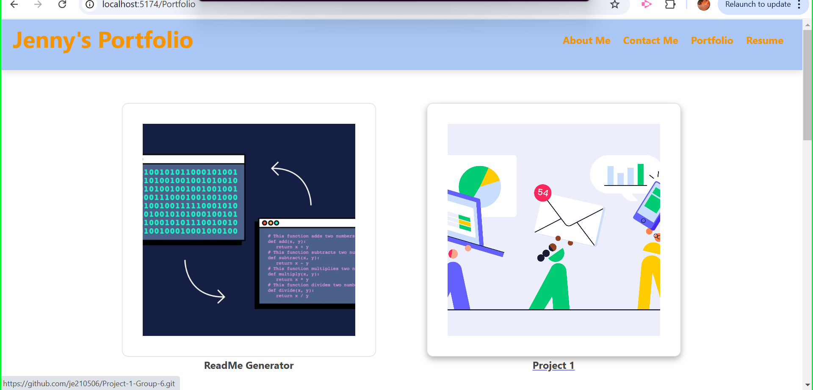

# Employee-Tracking-Database-1.0


## Description
This project is a React Portfolio built using the latest technologies, showcasing my skills, projects, and achievements. It is designed to set me apart from other developers whose portfolios do not utilize modern tools and frameworks. This portfolio will serve as a dynamic and responsive website, with an emphasis on clean design, user-friendly navigation, and modern React technologies. This portfolio is also deployed to Netlify for online access.


## Badge
None.


## Table of Contents
- [Installation](#installation)
- [Usage](#usage)
- [License](#license)
- [Contributing](#contributing)
- [Test Instructions](#testinstructions)
- [Questions](#questions)
   

## Installation 
1. Clone the Repository:
```
git clone <respository-SSH key>
cd employee-tracker
```
2. Navigate to the project directory:
```
cd Portfolio
```
3. Install the necessary ependencies:
```
npm install
```

4. Start the development server:

```
npm run dev
```

Your portfolio should now be running locally at ```http://localhost:3000```.


## Usage 
Once the portfolio is deployed, you can interact with the different sections to explore the projects, experience, and information about me. Here's a breakdown of how to navigate through the portfolio:

Navigation
-  Home/About Me: The landing page that introduces who I am with a brief introduction.

-  Portfolio: A gallery showcasing my completed projects with descriptions, links, and images.

-  Resume: A section presenting my professional experience, education, skills, and additional information.

-  Contact: A form for contacting me directly through email or other contact methods.


## License 
This project is not licensed. 


## Contributing 
Contributions are welcome! To contribute:
1. Fork the repository.

2. Create a new branch:
```
git checkout -b feature/yourFeature
```

3. Commit your changes:
```

git commit -m "Add new feature"
```

4. Push to your branch:
```

git push origin feature/yourFeature
```

5. Open a pull request for review.


## Test Instructions 
To test the application's functionality:

-  Check all sections for correct display and functionality (About, Portfolio, Resume, Contact).

-  Test the Contact Form: Ensure form validation works correctly and that a user can submit their message.

-  Test responsiveness by resizing the browser window to ensure the portfolio adjusts properly for mobile, tablet, and desktop screens.

-  Test any interactive elements (e.g., hover effects on portfolio images).

## Questions 
If there's any additional questions I can answer for you, you can reach out to me at https://github.com/je210506 or [lalanne1011@gmail.com](mailto:lalanne1011@gmail.com}).

